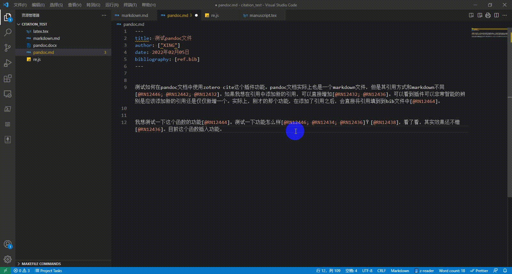
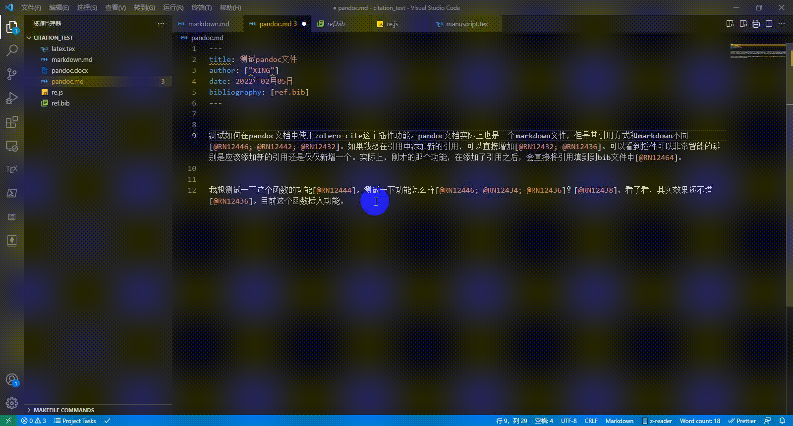
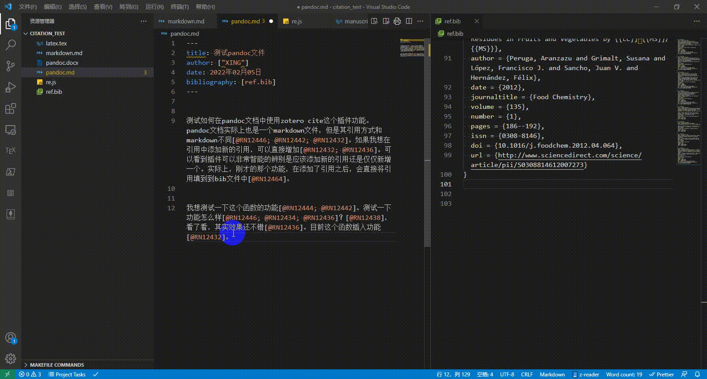
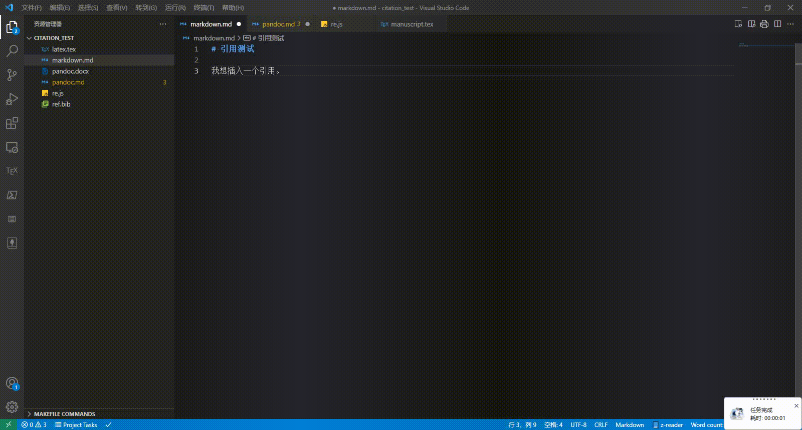
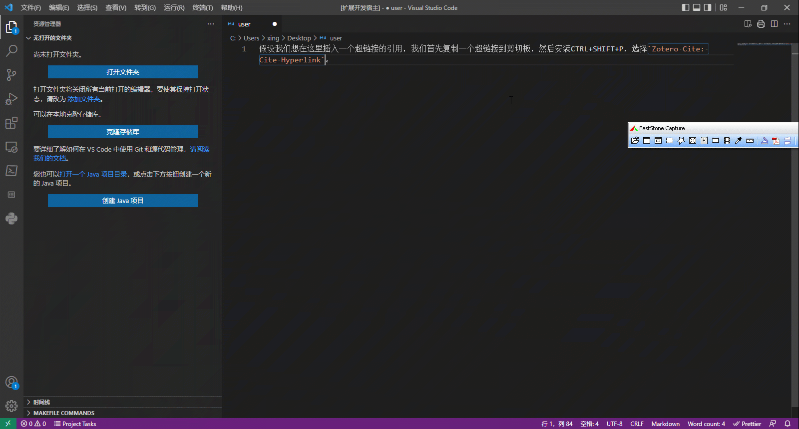

Original repo is located at [repo](https://gitee.com/rusterx/zotero-cite)

# zotero-cite README

在markdown、pandoc（.md后缀）以及latex文件的编写过程中，如果想要实现类似ms word文件的编辑过程，边插入边更新bib文件。或者想将当前文件的`key`列表，导出最终的bib文件，那么该插件就非常适合你。

In the process of writing markdown, pandoc (.md suffix) and latex files, if you want to achieve an editing process similar to ms word files, insert and update the bib file. Or if you want to export the final bib file from the `key` list of the current file, then this plugin is very suitable for you.

# Zotero Cite: Export BibLatex

查询当前编辑的markdown、pandoc或者latex文档，根据引用的key，导出引用至bib文件。

Query the currently edited markdown, pandoc or latex document, based on its environment, and export the citation to the bib document according to the cited key.

# Zotero Cite: Add Citation for Pandoc/Latex

如果你想在pandoc以及latex文档的书写过程中，希望插入citation，但是不想更新bib文件，那么这个功能比较适合你。

If you want to insert citations during the writing process of pandoc and latex documents, but do not want to update the bib file, then this function is more suitable for you.

# Zotero Cite: Cite and Create Bibliography for Pandoc/LaTeX

如果你想在pandoc以及latex文档的书写过程中，希望插入citation的同时更新bib文件，那么这个功能比较适合你。

If you want to update the bib file while inserting citations during the writing process of pandoc and latex documents, then this function is more suitable for you.

# Zotero Cite: Cite and Create Bibliography for Markdown

如果你想在markdown文档的书写过程中，希望插入citation的同时更新脚注，那么这个功能比较适合你。

If you want to update the footnotes while inserting the citation during the writing process of the markdown document, then this function is more suitable for you.

# Zotero Cite: Cite Hyperlink

# 修改历史

- 2021-11-01：创建了zotero-export插件并增加了文件名输入的功能。增加when支持，只允许在markdown或者latex环境下激发命令。

- 2021-11-02：将zotero-export插件更名为export-cite，优化bibliography导出到文件的功能，使其支持latex环境。同时添加了`zotero-cite.citeBibliography`以及`zotero-cite.citeMarkdownBibliography`两个命令，使其可以在插入引用的同时，将bibliography插入到默认的文件中。

- 2022-02-06： 对zotero-cite进行了全面的修改，使其可以支持markdown、pandoc以及latex环境的引用插入。可以智能的识别当前鼠标的位置是否在引用环境中，从而决定是应该直接插入，还是采用新增的方式插入引用。

- 2022-02-07：优化pandoc以及latex文件的插入引用函数，消耗资源更少。

- 2022-05-04：添加了markdown环境下，超链接的引用功能。

# Tutorial video

Yet to be updated